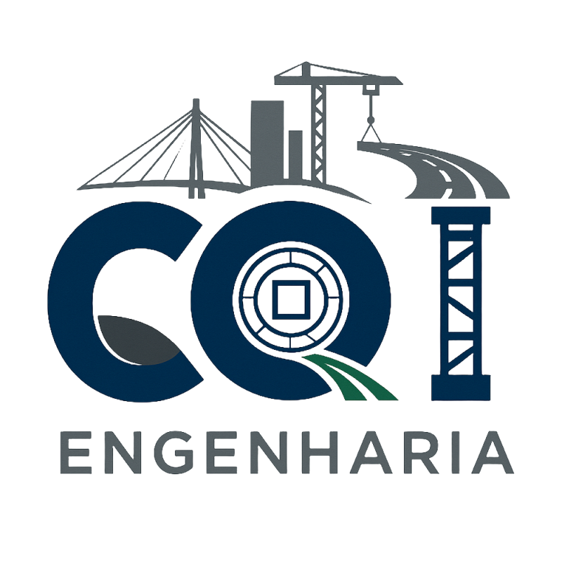
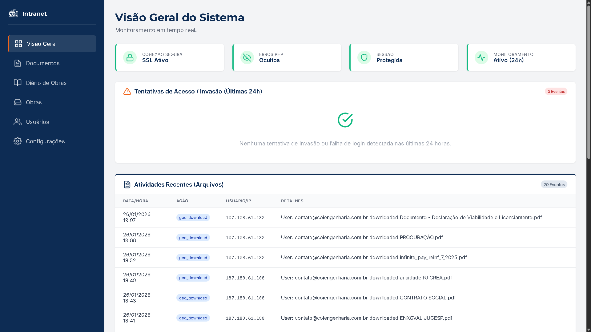
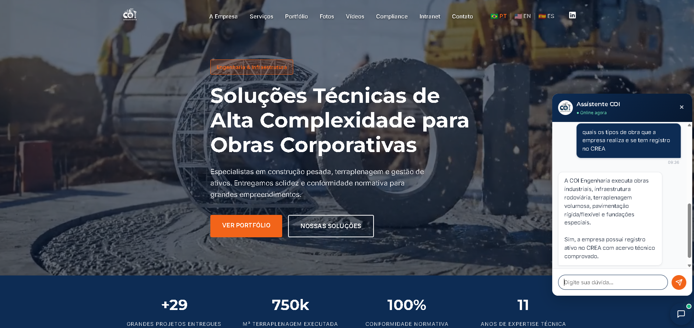
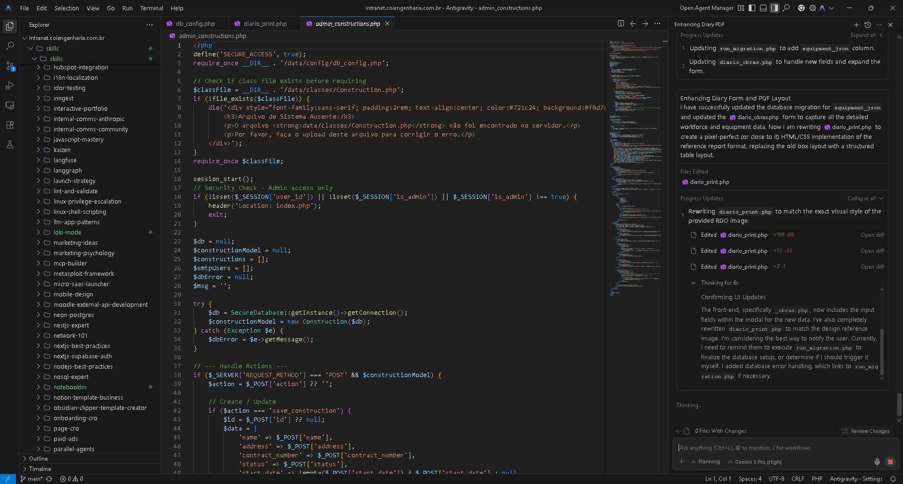

<div align="center">

  

  # COI Engenharia - Plataforma de Gestão & Inteligência
  
  **Sistema Integrado de Engenharia (RDO), GED e IA Corporativa para Obras de Alta Complexidade.**

  [](https://www.php.net/)
  [](https://www.mysql.com/)
  [](https://deepmind.google/technologies/gemini/)
  [](#security)
  [](LICENSE)

  [Sobre](#-contexto-e-propósito) • [Funcionalidades](#-funcionalidades-de-engenharia) • [Stack](#-%EF%B8%8F-arquitetura-e-stack) • [Segurança](#-cybersecurity--compliance) • [Instalação](#-instalação)

</div>

---

## 🏗️ Contexto e Propósito

Esta plataforma proprietária foi desenvolvida para sustentar a operação da **COI Engenharia**, uma empresa referência em obras industriais, infraestrutura rodoviária e geotecnia, sediada em Rio Claro/SP.

O sistema não é apenas um site, mas um **ERP Técnico** sob medida que gerencia contratos de grandes clientes (como **Grupo Assaí, Citrosuco, EIXO-SP e Grupo Muffato**), garantindo que a gestão da informação acompanhe o rigor técnico das obras de terraplenagem e pavimentação.

### Por que Vanilla PHP?
Para garantir **performance extrema** em canteiros de obras com conectividade instável (3G/4G) e longevidade do código (LTS) sem dependência de ciclos de atualização de frameworks de terceiros.

---

## 📸 Interface do Sistema

| **Intranet & Dashboard Operacional** | **Assistente Técnico (IA Gemini)** |
|:---:|:---:|
|  |  |
| *Visão em tempo real de contratos e segurança* | *IA treinada em NRs e dados da empresa* |

| **Engenharia de Software (Clean Code)** |
|:---:|
|  |
| *Arquitetura MVC pura, organizada e segura* |

---

## ✨ Funcionalidades de Engenharia

O sistema resolve dores específicas da construção civil pesada:

### 🧠 1. IA Corporativa (Gemini 2.0 Integration)
Agente virtual integrado via API REST que atua como "Engenheiro Assistente":
* **Consultas Técnicas:** Responde sobre acervo técnico e capacidades (ex: volume de terraplenagem, tipos de pavimentação).
* **Filtro Comercial:** Triagem automática de leads e fornecedores antes do contato humano.
* **Contexto:** System Prompt com engenharia de contexto baseada no portfólio real da COI.

### 📋 2. RDO Digital (Relatório Diário de Obras)
Substituição dos diários de papel por registros digitais auditáveis:
* **Clima & Pluviometria:** Registro preciso das condições meteorológicas (impacto direto em cronogramas).
* **Gestão de Ativos:** Controle de efetivo e maquinário pesado alocado por obra.
* **Evidência Fotográfica:** Galeria segura para documentação de avanço físico.

### 🔐 3. GED Técnico (Gestão Eletrônica de Documentos)
Repositório centralizado para projetos executivos e ARTs:
* **Estrutura de Pastas Dinâmica:** Navegação hierárquica similar ao Windows Explorer.
* **Download em Lote:** Compressão ZIP on-the-fly para pacotes de documentos.
* **Controle de Acesso:** Permissões granulares baseadas em cargo (Engenheiro, Mestre, Administrativo).

---

## 🛠️ Arquitetura e Stack

| Componente | Tecnologia | Justificativa Técnica |
| :--- | :--- | :--- |
| **Backend** | **PHP 8.2+ (Vanilla)** | Baixa latência, zero overhead, tipagem forte. |
| **Database** | **MySQL / MariaDB** | Conformidade ACID e alta disponibilidade. |
| **Frontend** | **HTML5 / CSS3 / JS** | Design System próprio, sem dependência de npm/node_modules. |
| **AI Core** | **Google Gemini API** | Modelo 2.0 Flash para inferência rápida e baixo custo. |
| **Server** | **Apache / Nginx** | Compatibilidade total com servidores Linux/Windows. |

---

## 🔒 Cybersecurity & Compliance

A segurança implementa o conceito de **Defense in Depth** (Defesa em Profundidade):

* **[CSP] Content Security Policy:** Bloqueio nativo de XSS e injeção de scripts não autorizados.
* **[HSTS] Strict Transport Security:** Força criptografia TLS/SSL em todas as requisições.
* **[Anti-Bot] Rate Limiting & Honeypot:** Proteção contra ataques de força bruta e crawlers sem uso de CAPTCHA intrusivo.
* **[Sanitização] Input Filtering:** Tratamento recursivo de todas as entradas (`$_GET`, `$_POST`) contra SQL Injection.
* **[Sessão] Session Hardening:** Cookies `HttpOnly` e `Secure` com regeneração de ID para evitar sequestro de sessão.

---

## ⚙️ Instalação

### Pré-requisitos
* PHP 8.0 ou superior (com extensões `curl`, `pdo`, `mbstring`).
* MySQL 5.7+ ou MariaDB.

### Passo a Passo

1.  **Clone o repositório:**
    ```bash
    git clone [https://github.com/marcelocoi/coi-engenharia-platform.git](https://github.com/marcelocoi/coi-engenharia-platform.git)
    ```

2.  **Banco de Dados:**
    * Crie um banco vazio.
    * Importe o script `database/schema.sql` para criar as tabelas e índices.

3.  **Configuração:**
    * Renomeie `src/config/db_config.example.php` para `db_config.php` e insira suas credenciais.
    * Crie um arquivo `.env` na raiz contendo: `GEMINI_API_KEY=sua_chave_aqui`.

4.  **Deploy:**
    * Configure o DocumentRoot do servidor para a pasta raiz.
    * Acesse `/src/public_site` (Site Institucional) ou `/src/intranet` (Sistema).

---

## 👤 Autor e Liderança

**Eng. Marcelo de Barros** *CEO da COI Engenharia & Full Stack Developer*

Engenheiro Civil com mais de 20 anos de experiência em obras de grande porte (Usina Nuclear Angra 3, Beto Carrero World, Rodovias) e desenvolvedor de soluções tecnológicas aplicadas à construção civil.

[](https://www.linkedin.com/company/108664081/) 
[](https://coiengenharia.com.br)

---

<div align="center">
  <sub>Copyright © 2026 COI Engenharia. Todos os direitos reservados. Código distribuído sob licença MIT para fins de portfólio.</sub>
</div>
